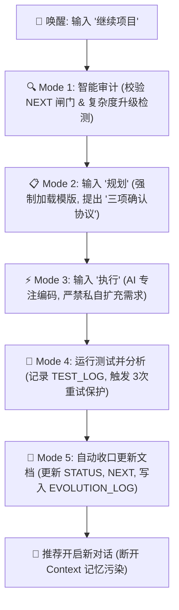

# ProjectOrchestrator 使用指南

## 方式一：作为按需调用的技能（Skill）

ProjectOrchestrator 已配置为标准技能，位于 `.agents/skills/project-orchestrator/SKILL.md`。支持技能发现机制的 AI IDE（如 Codex、Cursor 等）会自动识别并按需激活。

### 技能结构

```
.agents/skills/project-orchestrator/
├── SKILL.md                          # 核心技能文件（YAML frontmatter + 精简指令）
└── references/                       # 按需加载的参考文档
    ├── mode-reference.md             # 完整模式输出模板（Mode 0-6.5）
    └── forbidden-behaviors.md        # 禁止行为清单 + Git Hook 脚本
```

### 技能触发方式

技能通过 YAML frontmatter 中的 `description` 字段自动匹配。当用户表达以下意图时自动激活：

| 意图 | 触发词示例 |
|------|-----------|
| 继续开发 | "继续项目"、"继续开发"、"同步状态"、"continue"、"sync" |
| 任务规划 | "规划"、"plan"、"start task" |
| 确认执行 | "执行"、"确认"、"OK"、"approved" |
| 测试验证 | "运行测试"、"验证"、"test"、"validate" |
| 阶段收口 | "测试通过"、"收口"、"closeout" |
| 规则进化 | "优化规则"、"进化"、"evolve" |
| 项目初始化 | "启动项目"、"初始化"、"init"、"setup" |

### 技能激活后的行为

技能激活后，AI 会按照 SKILL.md 中定义的七模式执行引擎工作：

```
预检 → Mode 0 (初始化) → Mode 1 (审计) → Mode 2 (规划) 
→ Mode 3 (实现) → Mode 4 (验证) → Mode 4.5 (文档同步) 
→ Mode 5 (收口) → Mode 6 (进化提案) → Mode 6.5 (应用提案)
```

首次进入某模式时，AI 会自动读取 `references/mode-reference.md` 中对应的输出模板章节。

---

## 方式二：通过初始化脚本安装到目标项目

如果需要将 ProjectOrchestrator 部署到其他项目，使用根目录下的初始化脚本 `init.ps1` (Windows) 或 `init.sh` (Mac/Linux)，将适配器和 `.ai/` 配置文件结构部署到目标项目目录。

### 1. 命令行参数指南

* `-Path`: 目标项目的绝对/相对路径。
* `-IDE`: 需要安装的适配器。可选 `cursor`, `cline`, `windsurf`, `claude`, `gemini`, `antigravity`, `kiro`, `all`（默认全部）。
* `-Micro` / `-Lite`: 选择极简（3文件）或轻量（6文件）模式。不加则默认安装完整版（11文件）。
* `-Force`: 无损补充漏装文件，不覆盖已有数据。

### 2. 初始化示例（以 Windows 上的 Cursor 为例）

* **微型任务/临时脚本项目（Micro Mode）**：
  ```powershell
  .\init.ps1 -Path "D:\YourProject" -IDE "cursor" -Micro
  ```
* **个人开发/中小型项目（Lite Mode）**：
  ```powershell
  .\init.ps1 -Path "D:\YourProject" -IDE "cursor" -Lite
  ```
* **大型/正式产品维护项目（Full Mode）**：
  ```powershell
  .\init.ps1 -Path "D:\YourProject" -IDE "cursor"
  ```

  *(注：如需补充漏装文件，在命令尾部加 `-Force` 参数即可无损补充。)*

---

### 第二步：编辑 `.ai/` 控制文件

项目初始化后，在目标项目的 `.ai/` 目录下会出现控制文件。开启 AI 对话前，请先**手动编辑**以下关键文件：

1. **设置当前任务** — 编入 `NEXT.md`：写下当前最紧迫的**单个核心任务**及验收标准。
2. **设置项目实际现状** — 编入 `STATUS.md`：更新实际进展、痛点和关键指标（Micro 模式下直接在 `## TL;DR` 中简写一行）。
3. **设置长远规划** — 编入 `TASKS.md`、`DESIGN.md` 和 `requirements.md`（Lite/Full 模式适用）。

---

### 第三步：在 AI IDE 中开启标准开发循环

在适配了该 Skill 的 AI IDE 中（以 Cursor 为例，会自动加载 `.cursor/rules/project-orchestrator.mdc`），新开一个 Chat 对话，按以下流程驱动：



#### 🗣️ 常用交互指令（中英双语均支持）：

1. **启动/继续同步**："`继续项目`" / "`continue`"
   * AI 读取 `STATUS.md` 和 `NEXT.md`，执行闸门审核和时间戳审计，输出审计报告。
2. **生成计划**："`规划`" / "`plan`"
   * AI 检索历史踩坑教训，给出三项确认协议：① 目标理解、② 技术路径及改动文件、③ 首个交付物。
3. **确认执行**："`执行`" / "`confirm`" / "`OK`"
   * AI 正式进入代码编写和工具调用。
4. **测试收口**："`测试通过`" / "`closeout`"
   * AI 自动更新 `STATUS.md`、`NEXT.md` 和 `TASKS.md`，以 `📂 EVOLUTION_LOG` 格式记录，标志任务闭环。

---

## 模式选择指南

| 标准 | Micro | Lite | Full |
|------|-------|------|------|
| **代码量** | < 50 行，单任务 | < 5k 行，短期 | > 5k 行，长期 |
| **团队规模** | 个人，一次性 | 个人或 1-2 人 | 团队（2+） |
| **需要规划文件?** | 否（仅任务） | 是（需求+设计） | 是（全套） |
| **需要任务追溯?** | 否 | 最小 | 是（AUDIT/ADR） |
| **`.ai/` 文件数** | 3 + MODE_REFERENCE | 6 + MODE_REFERENCE | 11 + MODE_REFERENCE |

**快速判断**：
- 🐹 **Micro**：修复 bug、调整配置、写工具函数 → `init.ps1 -Micro`
- 🐱 **Lite**：个人项目、原型、周末黑客松 → `init.ps1 -Lite`
- 🐘 **Full**：生产项目、团队协作、长期维护 → `init.ps1`

> 💡 可以从 Micro 开始，后续用 `-Force` 升级，不会覆盖已有文件。

---

如果遇到与 generator 编译有关的问题，请查看 [README_CN.md](../README_CN.md) 了解更多细节。祝您使用 **ProjectOrchestrator** 开发愉快！
