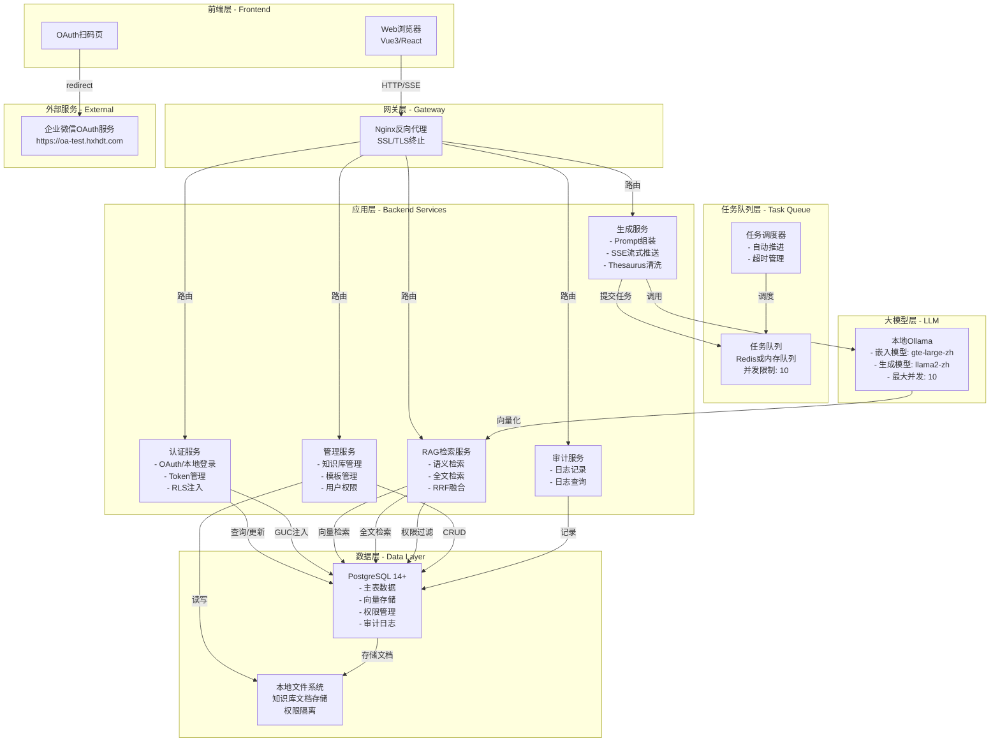
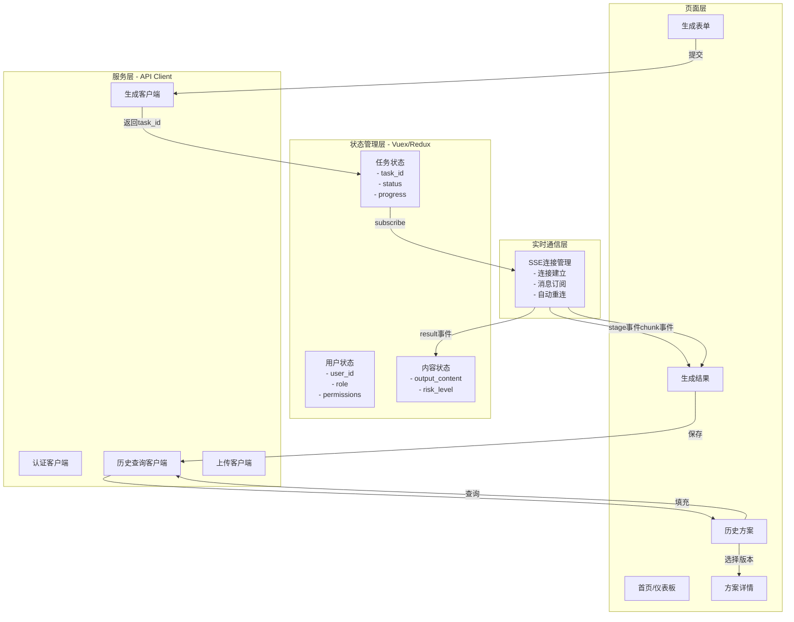

# 在宥丝巾 AI 营销方案生成辅助系统 - 设计文档

## 1. 系统架构设计

### 1.1 整体架构图



### 1.2 核心模块划分与职责

| 模块 | 职责 | 关键组件 |
|------|------|---------|
| **认证模块** | OAuth/本地登录、token管理、RLS环境变量注入 | AuthService、TokenManager、OAuthHandler |
| **RAG检索模块** | 语义/全文混合检索、RRF融合排序 | EmbeddingService、FullTextSearcher、RRFRanker |
| **生成模块** | Prompt组装、SSE推送、Thesaurus清洗、版本管理 | PromptAssembler、SSEStreamer、ThesaurusScanner |
| **管理模块** | 知识库/产品/模板/用户权限CRUD | DocumentManager、ProductManager、TemplateManager |
| **审计模块** | 操作日志记录、查询、导出 | AuditLogger、AuditQuerier |
| **任务调度模块** | 并发管理、排队、超时取消 | TaskQueue、TaskScheduler |

### 1.3 关键技术选型

| 层级 | 技术选型 | 理由 |
|------|---------|------|
| **后端框架** | Node.js + Express 或 Python + FastAPI | 支持SSE流式响应、开发效率高、社区活跃 |
| **前端框架** | Vue3 或 React | 现代化UI框架，支持实时数据更新 |
| **数据库** | PostgreSQL 14+ + pgvector + pg_trgm | 原生向量支持、全文检索、RLS、扩展性强 |
| **嵌入模型** | gte-large-zh 或 bge-m3 | 中文优化、1024维、开源本地部署 |
| **生成模型** | Ollama + llama2-zh 或 Qwen | 本地部署、隐私保护、成本低 |
| **任务队列** | Redis 或 内存队列(Node Bull/Python RQ) | 简单高效、支持优先级 |
| **SSE实现** | Express/FastAPI原生SSE | 简洁可靠、无额外依赖 |
| **文件存储** | 本地文件系统(可选NAS/SMB) | 隐私、性能、易于权限管理 |
| **缓存** | Redis(可选) | Token存储、会话管理 |

---

## 2. 前端架构设计

### 2.1 页面与功能模块清单

```
应用导航栏
├── 生成任务
│   ├── 新建任务表单页面（生成表单）
│   ├── 任务排队显示
│   └── 实时生成结果页面（SSE流式展示）
├── 历史方案
│   ├── 方案列表（含过滤/搜索）
│   ├── 方案详情页（复制、导出、再优化）
│   └── 版本对比页面（P1）
├── 知识库管理（仅Marketing_Manager及以上）
│   ├── 文档上传页
│   ├── 审核列表页
│   ├── 发布管理页
│   └── 文档预览
├── 竞品资料（仅Marketing_Manager及以上）
│   ├── 竞品资料列表
│   ├── 上传与分类
│   └── 审核管理
├── 后台管理（仅Administrator）
│   ├── 用户管理
│   ├── 角色权限配置
│   ├── 产品主表管理
│   ├── Prompt模板管理
│   ├── 审计日志查询
│   └── 系统配置
└── 登录页面
    ├── 企业微信扫码登录
    └── 本地账号登录（备用）
```

### 2.2 组件划分与交互流



### 2.3 生成任务表单设计

#### 表单字段

```json
{
  "form": {
    "required": {
      "product_id": {
        "label": "选择产品",
        "type": "select",
        "source": "GET /api/v1/products?status=active",
        "validation": "required",
        "error": "请选择产品"
      },
      "channel": {
        "label": "发布渠道",
        "type": "select",
        "options": [
          {"value": "xiaohongshu", "label": "小红书"},
          {"value": "wechat", "label": "微信朋友圈/公众号"},
          {"value": "e_commerce", "label": "电商平台（抖音/淘宝）"},
          {"value": "live", "label": "直播讲解词"},
          {"value": "gift", "label": "礼赠方案"}
        ],
        "validation": "required"
      },
      "scenario": {
        "label": "使用场景",
        "type": "textarea",
        "placeholder": "例：七夕大促种草、新品上市发布",
        "maxLength": 50,
        "validation": "required, maxLength:50",
        "error": "场景描述必填且不超过50字"
      }
    },
    "optional": {
      "target_audience": {
        "label": "目标人群（可选）",
        "type": "multiselect",
        "options": [
          {"value": "young_professionals", "label": "职场白领"},
          {"value": "students", "label": "在校学生"},
          {"value": "housewives", "label": "家庭主妇"},
          {"value": "collectors", "label": "收藏家"}
        ]
      },
      "tone_style": {
        "label": "语气调性（可选）",
        "type": "select",
        "default": "elegant",
        "options": [
          {"value": "elegant", "label": "优雅静谧"},
          {"value": "classical", "label": "东方古典"},
          {"value": "professional", "label": "知性大方"}
        ]
      },
      "prompt_template_id": {
        "label": "Prompt模板",
        "type": "select",
        "source": "推荐模板（基于channel+scenario）",
        "description": "系统自动推荐，可手动覆盖"
      },
      "is_competitor_referenced": {
        "label": "参考竞品风格",
        "type": "toggle",
        "default": false
      },
      "competitor_document_ids": {
        "label": "选择竞品资料",
        "type": "multiselect",
        "source": "GET /api/v1/competitor-documents?status=published",
        "depends_on": "is_competitor_referenced=true"
      },
      "extra_requirements": {
        "label": "额外要求（可选）",
        "type": "textarea",
        "placeholder": "例：突出植物成分、强调环保理念",
        "maxLength": 200,
        "validation": "maxLength:200"
      }
    }
  }
}
```

### 2.4 SSE流式连接管理

```javascript
// 前端SSE管理器伪代码
class SSEManager {
  constructor(taskId) {
    this.taskId = taskId;
    this.eventSource = null;
    this.buffer = "";
  }

  connect() {
    this.eventSource = new EventSource(
      `/api/v1/generator/tasks/${this.taskId}/stream`
    );

    // 监听stage事件（思考步骤）
    this.eventSource.addEventListener('stage', (event) => {
      const data = JSON.parse(event.data);
      this.updateStage(data);
      // 更新UI: 显示"正在检索"、"组装Prompt"等提示
    });

    // 监听chunk事件（文案内容）
    this.eventSource.addEventListener('chunk', (event) => {
      const data = JSON.parse(event.data);
      this.buffer += data.text;
      this.renderContent(this.buffer);
      // 实时展示生成的文案
    });

    // 监听result事件（完成）
    this.eventSource.addEventListener('result', (event) => {
      const data = JSON.parse(event.data);
      this.onComplete(data);
      this.eventSource.close();
    });

    // 自动重连
    this.eventSource.onerror = () => {
      this.resume();
    };
  }

  async resume() {
    // 调用恢复接口
    const response = await fetch(
      `/api/v1/generator/tasks/${this.taskId}/stream?resume=true`
    );
    const data = await response.json();

    if (data.completed) {
      this.onComplete(data);
    } else {
      // 显示已生成内容，继续监听后续输出
      this.buffer = data.already_generated_content;
      this.connect();
    }
  }

  updateStage(stageData) {
    // 更新UI中的处理步骤显示
    emit('stage-updated', stageData);
  }

  renderContent(content) {
    // 实时渲染生成的内容
    emit('content-rendered', content);
  }

  onComplete(result) {
    // 保存到历史记录
    emit('generation-completed', result);
  }
}
```

### 2.5 状态管理策略（以Vue3为例）

```javascript
// stores/generator.js - 生成任务状态管理
export const useGeneratorStore = defineStore('generator', {
  state: () => ({
    currentTask: {
      id: null,
      status: 'idle', // idle, queued, processing, completed, failed
      progress: 0,
      currentStage: null,
      output: '',
      riskLevel: null,
      riskNotes: []
    },
    generatedHistory: [],
    queue: {
      position: 0,
      totalWaiting: 0,
      estimatedWaitTime: 0
    }
  }),

  getters: {
    isProcessing: (state) => state.currentTask.status === 'processing',
    isQueued: (state) => state.currentTask.status === 'queued',
    hasCompleted: (state) => state.currentTask.status === 'completed'
  },

  actions: {
    async submitTask(formData) {
      const response = await fetch('/api/v1/generator/tasks', {
        method: 'POST',
        headers: { 'Content-Type': 'application/json' },
        body: JSON.stringify(formData)
      });
      const { task_id } = await response.json();
      this.currentTask.id = task_id;
      this.currentTask.status = 'queued';
      return task_id;
    },

    updateStage(stageData) {
      this.currentTask.currentStage = stageData;
    },

    appendContent(chunk) {
      this.currentTask.output += chunk;
    },

    completeTask(result) {
      this.currentTask.status = 'completed';
      this.currentTask.riskLevel = result.risk_level;
      this.currentTask.riskNotes = result.risk_notes;
      this.generatedHistory.unshift(result);
    },

    updateQueuePosition(queueData) {
      this.queue = queueData;
    }
  }
});
```

---

## 3. 后端架构设计

### 3.1 核心服务模块

#### 3.1.1 认证服务（AuthService）

```
AuthService
├── OAuthHandler
│   ├── generateAuthUrl(): 生成企业微信授权链接
│   ├── exchangeCode(code): 用授权码换取access_token
│   ├── getUserInfo(accessToken): 获取用户信息
│   └── handleCallback(code, state): 处理OAuth回调
├── LocalAuthHandler
│   ├── hashPassword(password): 密码哈希
│   ├── verifyPassword(hash, password): 验证密码
│   └── createLocalAccount(username, password): 创建本地账号
├── TokenManager
│   ├── generateSessionToken(): 生成会话token
│   ├── validateToken(token): 验证token有效性
│   └── revokeToken(token): 撤销token
└── RLSInjector
    ├── injectGUC(userId, userRole, departmentId): 注入RLS环境变量
    └── getCurrentContext(): 获取当前会话上下文
```

**OAuth流程实现**：
```python
# FastAPI示例
@router.get("/oauth/authorize")
async def authorize():
    """生成授权链接"""
    auth_url = f"https://oa-test.hxhdt.com/api/oauth/authorize?" + \
               f"client_id={CLIENT_ID}&" + \
               f"redirect_uri={REDIRECT_URI}&" + \
               f"response_type=code"
    return {"auth_url": auth_url}

@router.get("/oauth/callback")
async def oauth_callback(code: str, state: str):
    """处理OAuth回调"""
    # 步骤3: 换取token
    token_response = requests.post(
        "https://oa-test.hxhdt.com/api/oauth/token",
        data={
            "client_id": CLIENT_ID,
            "client_secret": CLIENT_SECRET,
            "grant_type": "authorization_code",
            "code": code
        }
    )
    access_token = token_response.json()["access_token"]
    
    # 步骤4: 获取用户信息
    user_response = requests.get(
        "https://oa-test.hxhdt.com/api/oauth/userinfo",
        headers={"Authorization": f"Bearer {access_token}"}
    )
    user_info = user_response.json()
    
    # 查询或创建用户
    user = await find_or_create_user(
        wecom_user_id=user_info["userid"],
        name=user_info["name"],
        avatar_url=user_info["avatar"]
    )
    
    # 生成会话token
    session_token = generate_session_token(user)
    
    # 重定向到前端，传递token
    return RedirectResponse(
        url=f"http://localhost:3000/?token={session_token}",
        status_code=303
    )

@router.post("/login")
async def local_login(username: str, password: str):
    """本地账号登录"""
    user = await db.query(
        "SELECT * FROM users WHERE username = %s",
        (username,)
    )
    if not user or not verify_password(user.password_hash, password):
        raise HTTPException(status_code=401, detail="Invalid credentials")
    
    session_token = generate_session_token(user)
    return {"token": session_token, "user": user}
```

#### 3.1.2 RAG检索服务（RAGService）

```
RAGService
├── EmbeddingService
│   ├── embed(text): 文本向量化
│   └── batch_embed(texts): 批量向量化
├── SemanticSearcher
│   ├── search(query_vector, k=20): 向量相似度Top-K
│   └── apply_filters(results, product_id, rls_scope): 过滤
├── FullTextSearcher
│   ├── search(query_text, k=20): 全文检索Top-K
│   └── apply_filters(results, product_id, rls_scope): 过滤
└── RRFRanker
    ├── compute_rrf_scores(semantic_results, fulltext_results): 计算RRF分数
    └── rerank(fused_results, top_n=5): 最终排序
```

**混合检索实现**：
```python
async def hybrid_search(
    query_text: str,
    product_id: int,
    user_context: dict
) -> List[dict]:
    """执行混合检索"""
    
    # 并行执行语义和全文检索
    query_vector = await embedding_service.embed(query_text)
    
    # 语义检索
    semantic_task = semantic_search_with_rls(
        query_vector, 
        product_id, 
        user_context
    )
    
    # 全文检索
    fulltext_task = fulltext_search_with_rls(
        query_text, 
        product_id, 
        user_context
    )
    
    semantic_results, fulltext_results = await asyncio.gather(
        semantic_task, 
        fulltext_task
    )
    
    # RRF融合排序
    fused = rrf_ranker.compute_rrf_scores(
        semantic_results, 
        fulltext_results
    )
    
    # 抽取Top-N
    top_n_results = fused[:5]
    
    return top_n_results

async def semantic_search_with_rls(
    query_vector: List[float],
    product_id: int,
    user_context: dict
) -> List[dict]:
    """带RLS的语义检索"""
    
    async with db.cursor() as cursor:
        # 注入RLS环境变量
        await cursor.execute(
            f"""
            SET LOCAL app.current_user_id = %s;
            SET LOCAL app.current_user_role = %s;
            SET LOCAL app.current_user_department = %s;
            """,
            (user_context['user_id'], 
             user_context['role'], 
             user_context['department_id'])
        )
        
        # 执行向量检索（触发RLS策略）
        await cursor.execute("""
            SELECT 
                id,
                content,
                metadata_cache,
                1 / (60 + ROW_NUMBER() 
                    OVER (ORDER BY embedding <-> %s)) 
                    AS rrf_score
            FROM knowledge_chunks
            WHERE 
                metadata_cache->>'status' = 'published'
                AND (metadata_cache->>'product_id' = %s 
                     OR metadata_cache->>'product_id' IS NULL)
            ORDER BY embedding <-> %s
            LIMIT 20;
            """,
            (str(query_vector), str(product_id), str(query_vector))
        )
        
        results = await cursor.fetchall()
        return results

# RRF融合算法实现
class RRFRanker:
    K = 60  # 融合参数
    
    def compute_rrf_scores(
        self, 
        semantic_results: List[dict], 
        fulltext_results: List[dict]
    ) -> List[dict]:
        """计算RRF分数并合并"""
        
        # 创建ID到排名的映射
        semantic_ranks = {r['id']: i+1 for i, r in enumerate(semantic_results)}
        fulltext_ranks = {r['id']: i+1 for i, r in enumerate(fulltext_results)}
        
        # 计算RRF分数
        all_ids = set(semantic_ranks.keys()) | set(fulltext_ranks.keys())
        scores = {}
        
        for doc_id in all_ids:
            semantic_rank = semantic_ranks.get(doc_id, float('inf'))
            fulltext_rank = fulltext_ranks.get(doc_id, float('inf'))
            
            rrf_score = (1 / (self.K + semantic_rank) + 
                        1 / (self.K + fulltext_rank))
            scores[doc_id] = rrf_score
        
        # 按RRF分数排序
        sorted_results = sorted(
            scores.items(),
            key=lambda x: x[1],
            reverse=True
        )
        
        # 返回排序后的结果
        return [{'id': doc_id, 'rrf_score': score} 
                for doc_id, score in sorted_results]
```

#### 3.1.3 生成服务（GeneratorService）

```
GeneratorService
├── PromptAssembler
│   ├── load_template(template_id): 加载模板
│   ├── inject_rag_context(rag_results, xml_tags): 注入RAG上下文
│   ├── inject_competitor_reference(competitor_docs): 注入竞品参考
│   ├── inject_few_shot_examples(examples): 注入少样本
│   └── assemble_final_prompt(): 组装最终Prompt
├── OllamaClient
│   ├── stream_generate(prompt): 流式生成
│   └── get_status(): 获取模型状态
├── SSEStreamer
│   ├── emit_stage(stage_data): 发送stage事件
│   ├── emit_chunk(content_chunk): 发送chunk事件
│   └── emit_result(result_data): 发送result事件
└── ThesaurusScanner
    ├── scan_forbidden_words(content): 扫描禁用词
    ├── replace_words(content, substitutes): 字词替换
    └── scan_competitor_words(content, competitor_list): 扫描竞品词
```

**Prompt组装过程**：
```python
class PromptAssembler:
    async def assemble_prompt(
        self,
        template_id: int,
        rag_context: List[dict],
        competitor_docs: List[dict],
        form_data: dict
    ) -> str:
        """组装最终Prompt"""
        
        # 1. 加载模板
        template = await self.load_template(template_id)
        system_prompt = template['system_prompt']
        few_shot_examples = json.loads(template['few_shot_examples'])
        thesaurus_rules = json.loads(template['thesaurus_rules'])
        
        # 2. 组装XML标签
        zaiyou_facts = "\n".join([
            f"- {chunk['content']}"
            for chunk in rag_context
        ])
        
        competitor_style = ""
        if competitor_docs:
            competitor_style = "\n".join([
                f"- 来自{doc['competitor_name']}的参考: {doc['content']}"
                for doc in competitor_docs
            ])
        
        # 3. 组装完整Prompt
        full_prompt = f"""
{system_prompt}

## 禁用词表
避免使用以下词汇，改用替换词:
"""
        
        for forbidden, replacement in zip(
            thesaurus_rules['禁用词'],
            thesaurus_rules['替换词']
        ):
            full_prompt += f"\n- {forbidden} → {replacement}"
        
        full_prompt += """

## 事实来源隔离

<zaiyou_brand_facts>
"""
        full_prompt += zaiyou_facts
        full_prompt += """
</zaiyou_brand_facts>
"""
        
        if competitor_style:
            full_prompt += """
<competitor_reference_style>
"""
            full_prompt += competitor_style
            full_prompt += """
</competitor_reference_style>

**重要**: 上面的<competitor_reference_style>仅用于修辞手法参考，严禁复制其中的品牌词、参数或价格。
"""
        
        # 4. 注入Few-Shot示例
        full_prompt += """

## 高质量示例参考
"""
        for example in few_shot_examples[:2]:  # 最多2个示例
            full_prompt += f"\n**输入**: {example['input']}\n"
            full_prompt += f"**输出**: {example['output']}\n"
        
        # 5. 添加用户输入
        full_prompt += f"""

## 用户任务
产品: {form_data.get('product_name')}
渠道: {form_data.get('channel')}
场景: {form_data.get('scenario')}
调性: {form_data.get('tone_style', '优雅静谧')}
额外要求: {form_data.get('extra_requirements', '')}

现在请生成符合上述要求的营销方案文案:
"""
        
        return full_prompt

    async def load_template(self, template_id: int) -> dict:
        """加载模板"""
        async with db.cursor() as cursor:
            await cursor.execute(
                """
                SELECT * FROM prompt_templates 
                WHERE id = %s AND is_current = true
                """,
                (template_id,)
            )
            return await cursor.fetchone()
```

**SSE流式推送实现**：
```python
from fastapi.responses import StreamingResponse
import asyncio
import json

@router.post("/api/v1/generator/tasks")
async def create_generation_task(request: GenerationRequest):
    """创建生成任务并返回SSE流"""
    
    # 1. 创建任务记录
    task_id = await db.insert(
        "generation_tasks",
        {
            "user_id": current_user.id,
            "product_id": request.product_id,
            "channel": request.channel,
            "scenario": request.scenario,
            "status": "queued",
            "created_at": datetime.now()
        }
    )
    
    # 2. 定义SSE事件生成器
    async def event_generator():
        try:
            # 3. 发送stage事件: 检索
            yield f'event: stage\ndata: {json.dumps({
                "step": "retrieving",
                "message": "正在执行RRF混合检索自有事实资料...",
                "elapsed_ms": 450
            })}\n\n'
            
            # 执行RAG检索
            rag_context = await rag_service.hybrid_search(
                request.scenario,
                request.product_id,
                current_user
            )
            await asyncio.sleep(0.1)  # 模拟处理
            
            # 4. 发送stage事件: 隔离
            yield f'event: stage\ndata: {json.dumps({
                "step": "isolating",
                "message": "已应用XML Tags隔离竞品事实，组装Prompt快照...",
                "elapsed_ms": 820
            })}\n\n'
            
            # 组装Prompt
            prompt = await prompt_assembler.assemble_prompt(
                request.prompt_template_id,
                rag_context,
                request.competitor_document_ids or [],
                request.dict()
            )
            
            # 保存Prompt快照
            await db.update(
                "generation_tasks",
                {"id": task_id},
                {"prompt_snapshot": prompt, "status": "processing"}
            )
            
            # 5. 发送stage事件: 注入
            yield f'event: stage\ndata: {json.dumps({
                "step": "injecting",
                "message": "正在载入Few-Shot示例并应用Thesaurus调性平替...",
                "elapsed_ms": 1200
            })}\n\n'
            
            await asyncio.sleep(0.1)  # 模拟处理
            
            # 6. 发送stage事件: 生成
            yield f'event: stage\ndata: {json.dumps({
                "step": "generating",
                "message": "东方美学调性已就绪，AI开始流式生成方案正文：",
                "elapsed_ms": 1500
            })}\n\n'
            
            # 7. 调用Ollama进行流式生成
            output_content = ""
            async for chunk in ollama_client.stream_generate(prompt):
                output_content += chunk
                
                # 实时推送chunk
                yield f'event: chunk\ndata: {json.dumps({
                    "text": chunk
                })}\n\n'
                
                await asyncio.sleep(0.01)  # 防止过快
            
            # 8. Thesaurus三阶段清洗
            thesaurus_scanner = ThesaurusScanner()
            
            # 第三阶段: 生成后扫描
            cleaned_content, risk_level, risk_notes = \
                thesaurus_scanner.scan_and_clean(
                    output_content,
                    rag_context,  # 用于竞品词检测
                    request.competitor_document_ids
                )
            
            # 9. 保存输出
            output_id = await db.insert(
                "generation_outputs",
                {
                    "task_id": task_id,
                    "output_content": cleaned_content,
                    "parent_output_id": request.parent_output_id,
                    "version_code": 1 if not request.parent_output_id 
                                  else await get_next_version(request.parent_output_id),
                    "risk_level": risk_level,
                    "risk_notes": json.dumps(risk_notes),
                    "created_at": datetime.now()
                }
            )
            
            # 10. 发送result事件
            yield f'event: result\ndata: {json.dumps({
                "task_id": task_id,
                "output_id": output_id,
                "output_content": cleaned_content,
                "risk_level": risk_level,
                "risk_notes": risk_notes
            })}\n\n'
            
        except CompetitorWordViolation as e:
            # 竞品词强拦截
            await db.update(
                "generation_tasks",
                {"id": task_id},
                {"status": "failed", "error_message": "竞品词污染"}
            )
            yield f'event: error\ndata: {json.dumps({
                "error": "输出内容检测到合规风险（竞品词污染），已自动中止"
            })}\n\n'
        except Exception as e:
            await db.update(
                "generation_tasks",
                {"id": task_id},
                {"status": "failed", "error_message": str(e)}
            )
            yield f'event: error\ndata: {json.dumps({
                "error": str(e)
            })}\n\n'
    
    # 返回SSE流响应
    return StreamingResponse(
        event_generator(),
        media_type="text/event-stream",
        headers={
            "Cache-Control": "no-cache",
            "Connection": "keep-alive",
            "X-Task-Id": str(task_id)
        }
    )

@router.get("/api/v1/generator/tasks/{task_id}/stream")
async def resume_task_stream(task_id: int, resume: bool = False):
    """恢复或查询任务状态"""
    
    task = await db.query(
        "SELECT * FROM generation_tasks WHERE id = %s",
        (task_id,)
    )
    
    if task['status'] == 'completed':
        # 任务已完成，返回完整结果
        output = await db.query(
            "SELECT * FROM generation_outputs WHERE task_id = %s",
            (task_id,)
        )
        return {
            "task_id": task_id,
            "status": "completed",
            "output_content": output['output_content'],
            "risk_level": output['risk_level'],
            "completed": True
        }
    
    elif task['status'] == 'processing' and resume:
        # 任务仍在处理，返回SSE流以继续监听
        return StreamingResponse(
            event_generator_for_task(task_id),
            media_type="text/event-stream"
        )
```

### 3.2 API网关与路由设计

```python
# routes/auth.py
@router.post("/api/v1/auth/login")
async def login(credentials: LoginRequest):
    """本地或OAuth登录"""
    pass

@router.get("/api/v1/auth/logout")
async def logout(current_user: User = Depends(get_current_user)):
    """退出登录"""
    pass

# routes/generator.py
@router.post("/api/v1/generator/tasks")
async def create_task(request: GenerationRequest):
    """创建生成任务（SSE流式）"""
    pass

@router.get("/api/v1/generator/tasks/{task_id}/stream")
async def get_task_stream(task_id: int, resume: bool = False):
    """查询/恢复任务流"""
    pass

# routes/history.py
@router.get("/api/v1/generator/outputs")
async def list_outputs(
    skip: int = 0,
    limit: int = 20,
    product_id: Optional[int] = None,
    channel: Optional[str] = None,
    risk_level: Optional[str] = None
):
    """查询历史方案"""
    pass

@router.get("/api/v1/generator/outputs/{output_id}")
async def get_output(output_id: int):
    """获取单个输出详情"""
    pass

@router.post("/api/v1/generator/outputs/{output_id}/copy")
async def copy_output(output_id: int):
    """复制输出（记录审计日志）"""
    pass

@router.post("/api/v1/generator/outputs/{output_id}/export")
async def export_output(output_id: int, format: str = "markdown"):
    """导出输出为Markdown"""
    pass

# routes/products.py
@router.get("/api/v1/products")
async def list_products(status: str = "active"):
    """获取产品列表"""
    pass

# routes/knowledge.py
@router.post("/api/v1/knowledge/documents/upload")
async def upload_document(file: UploadFile, permission_scope: dict):
    """上传知识文档"""
    pass

@router.get("/api/v1/knowledge/documents")
async def list_documents(status: str = "published"):
    """查询知识文档"""
    pass

@router.post("/api/v1/knowledge/documents/{doc_id}/publish")
async def publish_document(doc_id: int):
    """发布文档（Marketing_Manager）"""
    pass

# routes/audit.py
@router.get("/api/v1/audit/logs")
async def get_audit_logs(
    operation_type: Optional[str] = None,
    start_date: Optional[datetime] = None,
    end_date: Optional[datetime] = None
):
    """查询审计日志（Administrator）"""
    pass
```

### 3.3 任务队列与并发管理

```python
# services/task_scheduler.py
class TaskScheduler:
    MAX_CONCURRENT = 10
    QUEUE_TIMEOUT = 3600  # 1小时
    
    def __init__(self, redis_client=None):
        self.queue = redis_client or deque()  # Redis或内存队列
        self.processing = set()
        self.lock = asyncio.Lock()
    
    async def submit_task(self, task_id: int):
        """提交任务到队列"""
        async with self.lock:
            if len(self.processing) < self.MAX_CONCURRENT:
                # 直接处理
                await self.process_task(task_id)
            else:
                # 加入队列
                await self.queue.put({
                    "task_id": task_id,
                    "submitted_at": datetime.now()
                })
                
                # 更新UI: 排队位置
                position = await self.queue.qsize()
                await self.notify_queue_position(task_id, position)
    
    async def process_task(self, task_id: int):
        """处理单个任务"""
        self.processing.add(task_id)
        
        try:
            await db.update(
                "generation_tasks",
                {"id": task_id},
                {"status": "processing", "started_at": datetime.now()}
            )
            
            # 执行生成逻辑（SSE）
            await generation_service.generate(task_id)
            
        finally:
            self.processing.discard(task_id)
            
            # 处理下一个排队任务
            await self.process_next_queued()
    
    async def process_next_queued(self):
        """处理下一个排队任务"""
        async with self.lock:
            if self.queue.qsize() > 0:
                next_task = await self.queue.get()
                task_id = next_task["task_id"]
                await self.process_task(task_id)
    
    async def check_queue_timeouts(self):
        """定期检查排队超时"""
        # 后台任务，定时执行
        while True:
            async with self.lock:
                now = datetime.now()
                expired_tasks = []
                
                # 检查队列中的超时任务
                queue_list = list(self.queue.queue)
                for task in queue_list:
                    if (now - task["submitted_at"]).seconds > self.QUEUE_TIMEOUT:
                        expired_tasks.append(task["task_id"])
                        self.queue.queue.remove(task)
                
                # 更新数据库
                for task_id in expired_tasks:
                    await db.update(
                        "generation_tasks",
                        {"id": task_id},
                        {
                            "status": "failed",
                            "error_message": "排队超时，请重新提交"
                        }
                    )
            
            await asyncio.sleep(60)  # 每60秒检查一次

# 初始化任务调度器
scheduler = TaskScheduler()

# 定期检查超时的后台任务
asyncio.create_task(scheduler.check_queue_timeouts())
```

---

## 4. 数据库设计

### 4.1 完整DDL（PostgreSQL 14+）

```sql
-- ============================================
-- 1. 用户与权限表
-- ============================================

CREATE TABLE users (
    id SERIAL PRIMARY KEY,
    wecom_user_id VARCHAR(255) UNIQUE,
    username VARCHAR(255) UNIQUE,
    password_hash VARCHAR(512),
    name VARCHAR(255) NOT NULL,
    email VARCHAR(255),
    avatar_url VARCHAR(1024),
    department_id INTEGER,
    role VARCHAR(50),  -- marketing_staff, marketing_manager, administrator
    status VARCHAR(50) DEFAULT 'pending',  -- pending, active, disabled, locked
    locked_until TIMESTAMP,
    lock_reason TEXT,
    created_at TIMESTAMP DEFAULT CURRENT_TIMESTAMP,
    updated_at TIMESTAMP DEFAULT CURRENT_TIMESTAMP,
    created_by INTEGER REFERENCES users(id),
    CONSTRAINT role_check CHECK (role IN ('marketing_staff', 'marketing_manager', 'administrator')),
    CONSTRAINT status_check CHECK (status IN ('pending', 'active', 'disabled', 'locked'))
);

CREATE INDEX idx_users_wecom_id ON users(wecom_user_id);
CREATE INDEX idx_users_role ON users(role);
CREATE INDEX idx_users_status ON users(status);

-- ============================================
-- 2. 产品主表
-- ============================================

CREATE TABLE products (
    id SERIAL PRIMARY KEY,
    product_code VARCHAR(255) UNIQUE NOT NULL,
    name VARCHAR(255) NOT NULL,
    category VARCHAR(100),
    size_spec VARCHAR(255),
    material VARCHAR(255),
    standard_price DECIMAL(10, 2),
    series_name VARCHAR(255),
    design_story TEXT,
    selling_points JSONB,  -- JSON数组
    image_urls TEXT[],
    is_giftable BOOLEAN DEFAULT true,
    target_audience_tags TEXT[],
    status VARCHAR(50) DEFAULT 'active',  -- active, inactive
    created_at TIMESTAMP DEFAULT CURRENT_TIMESTAMP,
    updated_at TIMESTAMP DEFAULT CURRENT_TIMESTAMP,
    created_by INTEGER REFERENCES users(id),
    CONSTRAINT status_check CHECK (status IN ('active', 'inactive'))
);

CREATE INDEX idx_products_status ON products(status);
CREATE INDEX idx_products_name ON products(name);
CREATE INDEX idx_products_series ON products(series_name);

-- ============================================
-- 3. 知识库文档表
-- ============================================

CREATE TABLE knowledge_documents (
    id SERIAL PRIMARY KEY,
    title VARCHAR(255) NOT NULL,
    product_id INTEGER REFERENCES products(id),
    file_name VARCHAR(255),
    file_type VARCHAR(50),  -- docx, pdf, md, txt, xlsx
    file_path VARCHAR(1024),
    file_size BIGINT,
    status VARCHAR(50) DEFAULT 'draft',  -- draft, pending, published, rejected, archived
    visibility VARCHAR(50) DEFAULT 'custom',  -- all, private, custom
    permission_scope JSONB,  -- {"visibility":"custom","roles":[],"users":[],"departments":[]}
    content_preview TEXT,
    chunk_count INTEGER DEFAULT 0,
    created_by INTEGER REFERENCES users(id),
    reviewed_by INTEGER REFERENCES users(id),
    review_comment TEXT,
    published_at TIMESTAMP,
    created_at TIMESTAMP DEFAULT CURRENT_TIMESTAMP,
    updated_at TIMESTAMP DEFAULT CURRENT_TIMESTAMP,
    metadata JSONB,
    CONSTRAINT status_check CHECK (status IN ('draft', 'pending', 'published', 'rejected', 'archived')),
    CONSTRAINT visibility_check CHECK (visibility IN ('all', 'private', 'custom'))
);

CREATE INDEX idx_kd_status ON knowledge_documents(status);
CREATE INDEX idx_kd_product_id ON knowledge_documents(product_id);
CREATE INDEX idx_kd_visibility ON knowledge_documents(visibility);
CREATE INDEX idx_kd_created_by ON knowledge_documents(created_by);

-- ============================================
-- 4. 知识库切片表（含双路索引）
-- ============================================

CREATE TABLE knowledge_chunks (
    id SERIAL PRIMARY KEY,
    document_id INTEGER NOT NULL REFERENCES knowledge_documents(id) ON DELETE CASCADE,
    content TEXT NOT NULL,
    chunk_index INTEGER,
    metadata_cache JSONB,  -- 冗余权限和文档元数据
    embedding vector(1024),  -- pgvector向量
    tsvector_content tsvector,  -- 全文检索tsvector
    created_at TIMESTAMP DEFAULT CURRENT_TIMESTAMP,
    updated_at TIMESTAMP DEFAULT CURRENT_TIMESTAMP
);

-- HNSW索引用于向量相似度搜索
CREATE INDEX idx_kc_embedding ON knowledge_chunks 
    USING hnsw (embedding vector_cosine_ops) 
    WITH (m=16, ef_construction=200);

-- GIN倒排索引用于全文检索
CREATE INDEX idx_kc_tsvector ON knowledge_chunks 
    USING GIN (tsvector_content);

-- metadata_cache索引
CREATE INDEX idx_kc_metadata_status ON knowledge_chunks 
    USING GIN (metadata_cache jsonb_ops)
    WHERE metadata_cache->>'status' = 'published';

CREATE INDEX idx_kc_metadata_product ON knowledge_chunks 
    USING GIN (metadata_cache jsonb_ops)
    WHERE metadata_cache->>'product_id' IS NOT NULL;

-- ============================================
-- 5. 竞品资料表
-- ============================================

CREATE TABLE competitor_documents (
    id SERIAL PRIMARY KEY,
    competitor_name VARCHAR(255) NOT NULL,
    title VARCHAR(255),
    content TEXT NOT NULL,
    source_type VARCHAR(100),  -- website, social_media, app, etc.
    source_url VARCHAR(1024),
    compliance_note TEXT,
    status VARCHAR(50) DEFAULT 'draft',  -- draft, pending, published
    permission_scope JSONB,
    created_by INTEGER REFERENCES users(id),
    reviewed_by INTEGER REFERENCES users(id),
    created_at TIMESTAMP DEFAULT CURRENT_TIMESTAMP,
    updated_at TIMESTAMP DEFAULT CURRENT_TIMESTAMP,
    CONSTRAINT status_check CHECK (status IN ('draft', 'pending', 'published'))
);

CREATE INDEX idx_cd_status ON competitor_documents(status);
CREATE INDEX idx_cd_competitor_name ON competitor_documents(competitor_name);

-- ============================================
-- 6. Prompt模板表
-- ============================================

CREATE TABLE prompt_templates (
    id SERIAL PRIMARY KEY,
    name VARCHAR(255) NOT NULL,
    version INTEGER DEFAULT 1,
    system_prompt TEXT NOT NULL,
    few_shot_examples JSONB,  -- 数组: [{"input":"","output":""}]
    thesaurus_rules JSONB,  -- {"禁用词":[],"替换词":[],"竞品品牌词":[]}
    applicable_channels VARCHAR(255)[],  -- xiaohongshu, wechat, e_commerce, live, gift
    applicable_scenarios VARCHAR(255)[],
    is_current BOOLEAN DEFAULT false,
    status VARCHAR(50) DEFAULT 'active',  -- active, inactive
    change_log TEXT,
    approved_by INTEGER REFERENCES users(id),
    created_by INTEGER REFERENCES users(id),
    created_at TIMESTAMP DEFAULT CURRENT_TIMESTAMP,
    updated_at TIMESTAMP DEFAULT CURRENT_TIMESTAMP,
    CONSTRAINT status_check CHECK (status IN ('active', 'inactive'))
);

CREATE INDEX idx_pt_name ON prompt_templates(name);
CREATE INDEX idx_pt_is_current ON prompt_templates(is_current) WHERE is_current = true;
CREATE INDEX idx_pt_version ON prompt_templates(name, version);

-- ============================================
-- 7. 生成任务表
-- ============================================

CREATE TABLE generation_tasks (
    id SERIAL PRIMARY KEY,
    user_id INTEGER NOT NULL REFERENCES users(id),
    product_id INTEGER NOT NULL REFERENCES products(id),
    channel VARCHAR(50),  -- xiaohongshu, wechat, e_commerce, live, gift
    scenario VARCHAR(255),
    target_audience TEXT[],
    tone_style VARCHAR(100),
    prompt_template_id INTEGER REFERENCES prompt_templates(id),
    is_competitor_referenced BOOLEAN DEFAULT false,
    competitor_document_ids INTEGER[],
    extra_requirements TEXT,
    
    status VARCHAR(50) DEFAULT 'queued',  -- queued, processing, completed, failed
    queue_position INTEGER,
    estimated_wait_seconds INTEGER,
    
    prompt_snapshot TEXT,
    rag_context_snapshot JSONB,
    
    started_at TIMESTAMP,
    completed_at TIMESTAMP,
    error_message TEXT,
    
    created_at TIMESTAMP DEFAULT CURRENT_TIMESTAMP,
    updated_at TIMESTAMP DEFAULT CURRENT_TIMESTAMP,
    CONSTRAINT channel_check CHECK (channel IN ('xiaohongshu', 'wechat', 'e_commerce', 'live', 'gift')),
    CONSTRAINT status_check CHECK (status IN ('queued', 'processing', 'completed', 'failed'))
);

CREATE INDEX idx_gt_user_id ON generation_tasks(user_id);
CREATE INDEX idx_gt_product_id ON generation_tasks(product_id);
CREATE INDEX idx_gt_status ON generation_tasks(status);
CREATE INDEX idx_gt_created_at ON generation_tasks(created_at DESC);

-- ============================================
-- 8. 生成输出表（版本链）
-- ============================================

CREATE TABLE generation_outputs (
    id SERIAL PRIMARY KEY,
    task_id INTEGER NOT NULL REFERENCES generation_tasks(id) ON DELETE CASCADE,
    output_content TEXT NOT NULL,
    parent_output_id INTEGER REFERENCES generation_outputs(id),  -- 版本链
    version_code INTEGER DEFAULT 1,
    
    risk_level VARCHAR(50),  -- low, medium, high
    risk_notes JSONB,  -- 详细风险信息
    risk_scanned_at TIMESTAMP,
    
    created_at TIMESTAMP DEFAULT CURRENT_TIMESTAMP,
    updated_at TIMESTAMP DEFAULT CURRENT_TIMESTAMP,
    CONSTRAINT risk_level_check CHECK (risk_level IN ('low', 'medium', 'high'))
);

-- 版本链查询索引
CREATE INDEX idx_go_parent_output_id ON generation_outputs(parent_output_id);
CREATE INDEX idx_go_task_id ON generation_outputs(task_id);
CREATE INDEX idx_go_version_code ON generation_outputs(task_id, version_code);
CREATE INDEX idx_go_risk_level ON generation_outputs(risk_level);

-- ============================================
-- 9. 审计日志表
-- ============================================

CREATE TABLE audit_logs (
    id SERIAL PRIMARY KEY,
    user_id INTEGER REFERENCES users(id),
    operation_type VARCHAR(100),  -- copy, export, upload, delete, permission_change, etc.
    target_entity_type VARCHAR(100),  -- task, document, output, user, etc.
    target_entity_id INTEGER,
    ip_address INET,
    user_agent TEXT,
    description TEXT,
    status VARCHAR(50),  -- success, failure
    error_details TEXT,
    created_at TIMESTAMP DEFAULT CURRENT_TIMESTAMP
);

CREATE INDEX idx_audit_user_id ON audit_logs(user_id);
CREATE INDEX idx_audit_operation_type ON audit_logs(operation_type);
CREATE INDEX idx_audit_created_at ON audit_logs(created_at DESC);
CREATE INDEX idx_audit_target ON audit_logs(target_entity_type, target_entity_id);

-- ============================================
-- 10. RLS行级安全策略
-- ============================================

-- 启用行级安全
ALTER TABLE knowledge_documents ENABLE ROW LEVEL SECURITY;
ALTER TABLE knowledge_chunks ENABLE ROW LEVEL SECURITY;
ALTER TABLE competitor_documents ENABLE ROW LEVEL SECURITY;
ALTER TABLE generation_tasks ENABLE ROW LEVEL SECURITY;
ALTER TABLE generation_outputs ENABLE ROW LEVEL SECURITY;

-- 知识文档RLS策略
CREATE POLICY kd_rl_all ON knowledge_documents
    FOR SELECT
    USING (
        -- Administrator可见所有
        current_setting('app.current_user_role') = 'administrator'
        OR
        -- 创建人可见
        created_by = (current_setting('app.current_user_id')::integer)
        OR
        -- 已发布且权限匹配
        (
            status = 'published' AND
            (
                -- visibility = 'all'
                visibility = 'all'
                OR
                -- visibility = 'private'且创建人
                (visibility = 'private' AND created_by = (current_setting('app.current_user_id')::integer))
                OR
                -- visibility = 'custom'且权限匹配
                (
                    visibility = 'custom' AND
                    (
                        permission_scope->'roles' @> to_jsonb(current_setting('app.current_user_role')::text)
                        OR permission_scope->'users' @> to_jsonb(current_setting('app.current_user_id')::integer)
                        OR permission_scope->'departments' @> to_jsonb(current_setting('app.current_user_department')::integer)
                    )
                )
            )
        )
    );

-- 知识切片RLS策略（基于metadata_cache）
CREATE POLICY kc_rl_published ON knowledge_chunks
    FOR SELECT
    USING (
        -- metadata_cache.status = 'published'
        metadata_cache->>'status' = 'published'
        AND
        (
            -- Administrator可见所有
            current_setting('app.current_user_role') = 'administrator'
            OR
            -- 权限范围匹配
            (
                metadata_cache->'permission_scope'->>'visibility' = 'all'
                OR
                (
                    metadata_cache->'permission_scope'->>'visibility' = 'custom' AND
                    (
                        metadata_cache->'permission_scope'->'roles' @> to_jsonb(current_setting('app.current_user_role')::text)
                        OR metadata_cache->'permission_scope'->'users' @> to_jsonb(current_setting('app.current_user_id')::integer)
                        OR metadata_cache->'permission_scope'->'departments' @> to_jsonb(current_setting('app.current_user_department')::integer)
                    )
                )
            )
        )
    );

-- 生成任务RLS策略
CREATE POLICY gt_rl_own ON generation_tasks
    FOR SELECT
    USING (
        current_setting('app.current_user_role') = 'administrator'
        OR user_id = (current_setting('app.current_user_id')::integer)
        OR (
            current_setting('app.current_user_role') = 'marketing_manager'
            AND (
                SELECT department_id FROM users 
                WHERE id = (current_setting('app.current_user_id')::integer)
            ) = (
                SELECT department_id FROM users 
                WHERE id = generation_tasks.user_id
            )
        )
    );

-- ============================================
-- 11. 触发器：知识切片元数据缓存同步
-- ============================================

CREATE OR REPLACE FUNCTION sync_knowledge_chunk_metadata()
RETURNS TRIGGER AS $$
BEGIN
    -- 当knowledge_document更新时，同步metadata_cache
    UPDATE knowledge_chunks
    SET metadata_cache = jsonb_set(
        metadata_cache,
        '{status}',
        to_jsonb(NEW.status)
    )
    WHERE document_id = NEW.id;
    
    UPDATE knowledge_chunks
    SET metadata_cache = jsonb_set(
        metadata_cache,
        '{permission_scope}',
        to_jsonb(NEW.permission_scope)
    )
    WHERE document_id = NEW.id;
    
    RETURN NEW;
END;
$$ LANGUAGE plpgsql;

CREATE TRIGGER trg_sync_kc_metadata
    AFTER UPDATE ON knowledge_documents
    FOR EACH ROW
    WHEN (OLD.status IS DISTINCT FROM NEW.status OR OLD.permission_scope IS DISTINCT FROM NEW.permission_scope)
    EXECUTE FUNCTION sync_knowledge_chunk_metadata();

-- ============================================
-- 12. 触发器：产品停用时归档相关知识文档
-- ============================================

CREATE OR REPLACE FUNCTION archive_documents_on_product_inactive()
RETURNS TRIGGER AS $$
BEGIN
    IF NEW.status = 'inactive' AND OLD.status = 'active' THEN
        -- 异步队列写入（需配合后端应用）
        INSERT INTO task_queue (task_type, payload, created_at)
        VALUES (
            'archive_documents',
            jsonb_build_object('product_id', NEW.id),
            CURRENT_TIMESTAMP
        );
    END IF;
    RETURN NEW;
END;
$$ LANGUAGE plpgsql;

CREATE TRIGGER trg_product_status_change
    AFTER UPDATE ON products
    FOR EACH ROW
    WHEN (OLD.status IS DISTINCT FROM NEW.status)
    EXECUTE FUNCTION archive_documents_on_product_inactive();

-- ============================================
-- 13. 搜索通过完整文本索引的触发器
-- ============================================

CREATE OR REPLACE FUNCTION update_knowledge_chunk_tsvector()
RETURNS TRIGGER AS $$
BEGIN
    NEW.tsvector_content := to_tsvector('chinese', NEW.content);
    RETURN NEW;
END;
$$ LANGUAGE plpgsql;

CREATE TRIGGER trg_update_tsvector
    BEFORE INSERT OR UPDATE ON knowledge_chunks
    FOR EACH ROW
    EXECUTE FUNCTION update_knowledge_chunk_tsvector();

-- ============================================
-- 14. 扩展和配置
-- ============================================

-- 启用必要的扩展
CREATE EXTENSION IF NOT EXISTS pgvector;
CREATE EXTENSION IF NOT EXISTS pg_trgm;
CREATE EXTENSION IF NOT EXISTS unaccent;

-- 设置中文分词器（如使用pg_jieba或scws）
CREATE TEXT SEARCH CONFIGURATION chinese (COPY = simple);
ALTER TEXT SEARCH CONFIGURATION chinese
    ALTER MAPPING FOR word, asciiword WITH simple;
```

### 4.2 索引策略详解

| 索引类型 | 目的 | 字段 | 性能指标 |
|---------|------|------|---------|
| **HNSW** | 向量相似度搜索 | knowledge_chunks.embedding | <100ms (K=20) |
| **GIN** | 全文检索 | knowledge_chunks.tsvector_content | <200ms (文本长度) |
| **GIN** | JSONB权限过滤 | metadata_cache | O(1) 常数时间 |
| **B-tree** | 状态/日期过滤 | status, created_at | <10ms |
| **复合索引** | 版本链查询 | (task_id, version_code) | <10ms |

### 4.3 RLS实现细节

```sql
-- 会话级GUC环境变量注入示例
BEGIN;

SET LOCAL app.current_user_id = '1001';
SET LOCAL app.current_user_role = 'marketing_staff';
SET LOCAL app.current_user_department = '10';

-- 在此会话内执行的查询自动应用RLS
SELECT * FROM knowledge_documents 
WHERE status = 'published';  -- 自动过滤权限

-- 事务结束时自动清理GUC
COMMIT;

-- 示例: 应用代码中的GUC注入
async with db.connection() as conn:
    async with conn.transaction():
        # 注入会话级GUC
        await conn.execute(f"""
            SET LOCAL app.current_user_id = %s;
            SET LOCAL app.current_user_role = %s;
            SET LOCAL app.current_user_department = %s;
        """, (user_id, role, dept_id))
        
        # 执行业务查询，RLS自动应用
        result = await conn.fetch("""
            SELECT id, title, content FROM knowledge_documents
            WHERE status = 'published'
        """)
```

---

## 5. API接口规范

### 5.1 生成任务接口（SSE流式）

```http
POST /api/v1/generator/tasks HTTP/1.1
Content-Type: application/json
Accept: text/event-stream
Authorization: Bearer {session_token}

{
  "product_id": 123,
  "channel": "xiaohongshu",
  "scenario": "七夕大促种草文案",
  "target_audience": ["young_professionals", "collectors"],
  "tone_style": "elegant",
  "prompt_template_id": 5,
  "is_competitor_referenced": true,
  "competitor_document_ids": [1, 2],
  "extra_requirements": "突出丝绸材质和手工工艺"
}
```

**SSE响应事件序列**:
```
event: stage
data: {"step": "retrieving", "message": "正在执行RRF混合检索...", "elapsed_ms": 450}

event: stage
data: {"step": "isolating", "message": "已应用XML Tags隔离竞品事实...", "elapsed_ms": 820}

event: stage
data: {"step": "injecting", "message": "正在载入Few-Shot示例...", "elapsed_ms": 1200}

event: stage
data: {"step": "generating", "message": "AI开始流式生成文案...", "elapsed_ms": 1500}

event: chunk
data: {"text": "这是一款"}

event: chunk
data: {"text": "融合东方美学"}

...更多chunk...

event: result
data: {
  "task_id": 8802,
  "output_id": 5541,
  "output_content": "完整的生成文案...",
  "risk_level": "low",
  "risk_notes": [],
  "version_code": 1
}
```

### 5.2 任务恢复接口

```http
GET /api/v1/generator/tasks/8802/stream?resume=true HTTP/1.1
Authorization: Bearer {session_token}

HTTP/1.1 200 OK
Content-Type: application/json

{
  "task_id": 8802,
  "status": "processing",
  "already_generated_content": "已生成的部分文案...",
  "remaining_output": "剩余需要生成的部分...",
  "completed": false,
  "resume_expire_seconds": 300
}
```

### 5.3 历史查询接口

```http
GET /api/v1/generator/outputs?skip=0&limit=20&risk_level=low&channel=xiaohongshu HTTP/1.1
Authorization: Bearer {session_token}

HTTP/1.1 200 OK
Content-Type: application/json

{
  "total": 150,
  "items": [
    {
      "id": 5541,
      "task_id": 8802,
      "product_name": "山海经系列丝巾",
      "channel": "xiaohongshu",
      "scenario": "七夕大促种草",
      "output_content": "...",
      "risk_level": "low",
      "created_at": "2024-01-15T10:30:00Z",
      "parent_output_id": null,
      "version_code": 1
    }
  ]
}
```

### 5.4 复制接口

```http
POST /api/v1/generator/outputs/5541/copy HTTP/1.1
Authorization: Bearer {session_token}

HTTP/1.1 200 OK
Content-Type: application/json

{
  "success": true,
  "message": "内容已复制到剪贴板",
  "audit_log_id": 12345
}
```

**审计记录**:
```sql
INSERT INTO audit_logs (
  user_id, operation_type, target_entity_type, target_entity_id,
  ip_address, user_agent, description, status
) VALUES (
  1001, 'copy', 'output', 5541,
  '192.168.1.100', 'Mozilla/5.0...',
  '复制生成文案', 'success'
);
```

### 5.5 导出接口

```http
POST /api/v1/generator/outputs/5541/export?format=markdown HTTP/1.1
Authorization: Bearer {session_token}

HTTP/1.1 200 OK
Content-Type: application/octet-stream
Content-Disposition: attachment; filename="output_5541.md"

# 在宥丝巾 AI生成方案

**产品**: 山海经系列丝巾  
**渠道**: 小红书  
**场景**: 七夕大促种草  
**生成时间**: 2024-01-15 10:30:00

## 生成内容

[完整文案内容]

---

> 免责声明: 本内容由AI生成，使用前需人工审核。
```

### 5.6 知识文档上传接口

```http
POST /api/v1/knowledge/documents/upload HTTP/1.1
Content-Type: multipart/form-data
Authorization: Bearer {session_token}

FormData:
  file: [binary file]
  product_id: 123
  permission_scope: {
    "visibility": "custom",
    "roles": ["marketing_staff", "marketing_manager"],
    "departments": ["10", "20"]
  }

HTTP/1.1 201 Created
Content-Type: application/json

{
  "document_id": 456,
  "title": "山海经系列营销方案",
  "status": "draft",
  "chunk_count": 25,
  "upload_timestamp": "2024-01-15T10:30:00Z"
}
```

### 5.7 产品列表接口

```http
GET /api/v1/products?status=active&keyword=山海 HTTP/1.1
Authorization: Bearer {session_token}

HTTP/1.1 200 OK
Content-Type: application/json

{
  "total": 45,
  "items": [
    {
      "id": 123,
      "product_code": "SH001",
      "name": "山海经系列丝巾",
      "series_name": "山海经",
      "category": "丝巾",
      "standard_price": 299.00,
      "image_urls": ["https://..."],
      "is_giftable": true,
      "target_audience_tags": ["collectors", "gift"]
    }
  ]
}
```

---

## 6. RAG与AI生成流程设计

### 6.1 双路检索详细实现

```
┌─────────────────────────────────────────┐
│ 用户查询: "山海经系列适合七夕礼赠吗？"    │
└────────────┬────────────────────────────┘
             │
      ┌──────┴──────┐
      │             │
   语义路          全文路
      │             │
      ↓             ↓
┌──────────────┐ ┌──────────────┐
│ 向量化查询   │ │ 分词检索查询  │
│ embedding()  │ │ parse_query() │
└──────┬───────┘ └───────┬──────┘
       │                 │
       ↓                 ↓
┌──────────────┐ ┌──────────────┐
│ HNSW检索     │ │ GIN检索      │
│ TOP-20       │ │ TOP-20       │
│ 根据cosine   │ │ 根据ts_rank  │
│ distance     │ │              │
└──────┬───────┘ └───────┬──────┘
       │                 │
       └────────┬────────┘
                │
                ↓
        ┌──────────────────┐
        │ RRF融合排序      │
        │ 计算RRF_Score    │
        │ 选取Top-5        │
        └────────┬─────────┘
                 │
                 ↓
        ┌──────────────────┐
        │ 应用RLS过滤      │
        │ 权限验证         │
        │ 状态检查         │
        └────────┬─────────┘
                 │
                 ↓
        ┌──────────────────┐
        │ 最终上下文集合   │
        │ 作为RAG输入      │
        └──────────────────┘
```

### 6.2 RRF融合算法详细计算

```python
def rrf_fusion(semantic_results, fulltext_results, k=60, top_n=5):
    """
    RRF (Reciprocal Rank Fusion) 融合算法
    
    公式: RRF_Score(d) = Σ 1/(k + rank_m(d))
    其中:
      - k = 60 (融合参数)
      - rank_m(d) = 文档d在路径m中的排名
    """
    
    # Step 1: 建立排名映射
    semantic_ranks = {
        result['chunk_id']: i + 1 
        for i, result in enumerate(semantic_results)
    }
    
    fulltext_ranks = {
        result['chunk_id']: i + 1 
        for i, result in enumerate(fulltext_results)
    }
    
    # Step 2: 计算RRF分数
    all_chunk_ids = set(semantic_ranks.keys()) | set(fulltext_ranks.keys())
    rrf_scores = {}
    
    for chunk_id in all_chunk_ids:
        # 缺失排名记为无穷大
        rank_semantic = semantic_ranks.get(chunk_id, float('inf'))
        rank_fulltext = fulltext_ranks.get(chunk_id, float('inf'))
        
        # RRF分数计算
        score = 0
        if rank_semantic != float('inf'):
            score += 1 / (k + rank_semantic)
        if rank_fulltext != float('inf'):
            score += 1 / (k + rank_fulltext)
        
        rrf_scores[chunk_id] = score
    
    # Step 3: 排序并取Top-N
    sorted_chunks = sorted(
        rrf_scores.items(),
        key=lambda x: x[1],
        reverse=True
    )[:top_n]
    
    return [
        {
            'chunk_id': chunk_id,
            'rrf_score': score
        }
        for chunk_id, score in sorted_chunks
    ]

# 示例计算
semantic_results = [
    {'chunk_id': 101, 'similarity': 0.92},   # 排名1
    {'chunk_id': 102, 'similarity': 0.88},   # 排名2
    {'chunk_id': 103, 'similarity': 0.85},   # 排名3
]

fulltext_results = [
    {'chunk_id': 103, 'ts_rank': 0.95},      # 排名1
    {'chunk_id': 104, 'ts_rank': 0.91},      # 排名2
    {'chunk_id': 101, 'ts_rank': 0.87},      # 排名3
]

# 计算:
# chunk_101: 1/(60+1) + 1/(60+3) = 0.0164 + 0.0159 = 0.0323
# chunk_102: 1/(60+2) + 0 = 0.0160
# chunk_103: 1/(60+3) + 1/(60+1) = 0.0159 + 0.0164 = 0.0323
# chunk_104: 0 + 1/(60+2) = 0.0160

# Top-5 (实际取top-3): [101, 103, 102]
```

### 6.3 Prompt组装与XML隔离

```
┌──────────────────────────────────────────┐
│ 最终Prompt结构                            │
└──────────────────────────────────────────┘

【系统指令】
你是在宥丝巾品牌官方AI内容专家。
你的任务是根据自有事实、用户需求生成符合品牌调性的营销文案。
重要约束:
  1. 所有事实陈述必须且只能基于<zaiyou_brand_facts>数据
  2. <competitor_reference_style>仅用于修辞手法参考，禁止复制品牌词、参数、价格
  3. 严禁在输出中包含任何'<'或'>'符号
  4. 避免使用禁用词，如：闭眼入→静谧之选、爆款→臻品

【禁用词表】
禁用词	| 替换词
--------|--------
闭眼入  | 静谧之选
爆款    | 臻品
家人们啊| 亲爱的朋友

【自有事实隔离区】
<zaiyou_brand_facts>
- 山海经系列采用桑蚕丝材质，设计灵感源自山海经图腾
- 适用场景：礼赠、收藏、日常搭配
- 材质特点：保暖、透气、高端质感
- 目标客群：白领、收藏家、品质生活追求者
- 价格区间：280-580元
- 工艺：全手工绘制、限量发售
</zaiyou_brand_facts>

【竞品参考隔离区】
<competitor_reference_style>
竞品A的营销手法参考:
- 排版: 先视觉冲击 → 场景渲染 → 功能介绍 → 行动号召
- 文风: 优雅、知性、略带文艺气息
- 修辞手法: 排比、对偶、比喻
- 标签使用: #东方美学 #手工艺 #小众精致
</competitor_reference_style>

【Few-Shot示例】
输入示例1: 我是小红书内容创作者，需要一篇七夕种草文案
输出示例1: 
七夕时节，予你一份暗示。
山海经系列丝巾，东方纹样与现代剪裁的对话...

输入示例2: 礼赠文案，用于企业答谢客户
输出示例2:
感恩一年的陪伴，我们精选了...

【用户任务】
渠道: 小红书
场景: 七夕大促种草
语调: 优雅静谧
额外需求: 突出手工工艺和限量感

现在请基于上述要求生成营销文案:
```

---

## 7. 权限与安全设计

### 7.1 RBAC角色权限矩阵

| 功能 | Marketing_Staff | Marketing_Manager | Administrator |
|------|---|---|---|
| 创建生成任务 | ✓ | ✓ | ✓ |
| 查看自己的历史 | ✓ | ✓ | ✓ |
| 查看部门内历史 | ✗ | ✓ | ✓ |
| 查看全部历史 | ✗ | ✗ | ✓ |
| 上传知识文档 | ✓ | ✓ | ✓ |
| 审核发布文档 | ✗ | ✓ | ✓ |
| 上传竞品资料 | ✗ | ✓ | ✓ |
| 管理产品主表 | ✗ | ✗ | ✓ |
| 管理Prompt模板 | ✗ | ✗ | ✓ |
| 管理用户账号 | ✗ | ✗ | ✓ |
| 查看审计日志 | ✗ | ✗ | ✓ |

### 7.2 RLS行级过滤实现

```sql
-- 会话级GUC变量在请求处理开始时注入
BEGIN;

SET LOCAL app.current_user_id = '1001';
SET LOCAL app.current_user_role = 'marketing_staff';
SET LOCAL app.current_user_department = '10';

-- 查询自动应用RLS策略
SELECT * FROM knowledge_documents 
WHERE status = 'published';

-- 对于marketing_staff用户，只返回:
-- - visibility='all' 的文档
-- - 或 permission_scope 中包含其角色/用户ID/部门ID的文档

COMMIT;
```

### 7.3 企业微信OAuth完整流程图

```
┌─────────────────────────────────────────┐
│ 前端: 用户点击"企业微信登录"             │
└────────────┬────────────────────────────┘
             │
             ↓
┌─────────────────────────────────────────┐
│ 后端: generateAuthUrl()                  │
│ 构造授权链接:                            │
│ https://oa-test.hxhdt.com/api/oauth/... │
└────────────┬────────────────────────────┘
             │
             ↓
┌─────────────────────────────────────────┐
│ 前端: 跳转到企业微信授权页面             │
└────────────┬────────────────────────────┘
             │
             ↓
┌─────────────────────────────────────────┐
│ 用户: 企业微信扫码确认授权               │
└────────────┬────────────────────────────┘
             │
             ↓
┌─────────────────────────────────────────┐
│ 企业微信: 重定向到回调地址               │
│ http://localhost:8080/oauth/callback     │
│ 携带参数: code=xxx, state=xxx            │
└────────────┬────────────────────────────┘
             │
             ↓
┌─────────────────────────────────────────┐
│ 后端: handleCallback(code, state)        │
│ POST https://oa-test.hxhdt.com/api/...   │
│ 用code + client_secret交换access_token   │
└────────────┬────────────────────────────┘
             │
             ↓
┌─────────────────────────────────────────┐
│ 后端: 使用access_token获取用户信息      │
│ GET https://oa-test.hxhdt.com/api/...    │
└────────────┬────────────────────────────┘
             │
             ↓
┌─────────────────────────────────────────┐
│ 后端: 查询/创建users表记录              │
│ - wecom_user_id: userid                 │
│ - name: name                            │
│ - avatar_url: avatar                    │
│ - status: pending (待分配)               │
└────────────┬────────────────────────────┘
             │
             ↓
┌─────────────────────────────────────────┐
│ 后端: 生成会话token                     │
│ token = sign(user_id, role, expiry)      │
└────────────┬────────────────────────────┘
             │
             ↓
┌─────────────────────────────────────────┐
│ 后端: 重定向到前端，传递token           │
│ http://localhost:3000/?token=...         │
└────────────┬────────────────────────────┘
             │
             ↓
┌─────────────────────────────────────────┐
│ 前端: 保存token至localStorage            │
│ 后续请求在Authorization头中附加token     │
└─────────────────────────────────────────┘
```

### 7.4 Token生命周期管理

```python
class TokenManager:
    TOKEN_EXPIRY_SECONDS = 86400  # 24小时
    
    def generate_session_token(self, user):
        """生成会话token"""
        payload = {
            'user_id': user.id,
            'role': user.role,
            'department_id': user.department_id,
            'exp': datetime.utcnow() + timedelta(seconds=self.TOKEN_EXPIRY_SECONDS),
            'iat': datetime.utcnow()
        }
        token = jwt.encode(payload, SECRET_KEY, algorithm='HS256')
        return token
    
    def validate_token(self, token):
        """验证token有效性"""
        try:
            payload = jwt.decode(token, SECRET_KEY, algorithms=['HS256'])
            return payload
        except jwt.ExpiredSignatureError:
            raise HTTPException(status_code=401, detail="Token已过期")
        except jwt.InvalidTokenError:
            raise HTTPException(status_code=401, detail="Token无效")
    
    def refresh_token(self, old_token):
        """刷新token"""
        payload = self.validate_token(old_token)
        # 移除旧的exp，重新生成
        payload.pop('exp')
        payload['exp'] = datetime.utcnow() + timedelta(seconds=self.TOKEN_EXPIRY_SECONDS)
        new_token = jwt.encode(payload, SECRET_KEY, algorithm='HS256')
        return new_token
```

---

## 8. 并发与队列管理

### 8.1 Ollama并发限制机制

```python
class OllamaClientWithConcurrencyControl:
    MAX_CONCURRENT = 10
    
    def __init__(self):
        self.semaphore = asyncio.Semaphore(self.MAX_CONCURRENT)
        self.active_tasks = set()
    
    async def stream_generate(self, prompt):
        """受限制的流式生成"""
        async with self.semaphore:
            self.active_tasks.add(asyncio.current_task())
            try:
                async for chunk in self._call_ollama(prompt):
                    yield chunk
            finally:
                self.active_tasks.discard(asyncio.current_task())
    
    async def _call_ollama(self, prompt):
        """调用本地Ollama"""
        async with aiohttp.ClientSession() as session:
            async with session.post(
                'http://localhost:11434/api/generate',
                json={'model': 'llama2-zh', 'prompt': prompt, 'stream': True}
            ) as resp:
                async for line in resp.content:
                    if line:
                        data = json.loads(line)
                        yield data.get('response', '')
    
    def get_active_count(self):
        """获取当前活跃任务数"""
        return len(self.active_tasks)

# 全局单例
ollama_client = OllamaClientWithConcurrencyControl()
```

### 8.2 任务队列与排队显示

```python
class TaskQueueManager:
    def __init__(self, redis_url=None):
        # 使用Redis或内存队列
        if redis_url:
            self.redis = aioredis.from_url(redis_url)
            self.queue_key = 'generation_tasks:queue'
        else:
            self.queue = asyncio.Queue()
    
    async def submit_task(self, task_id):
        """提交任务"""
        current_active = ollama_client.get_active_count()
        
        if current_active < ollama_client.MAX_CONCURRENT:
            # 直接处理
            await generation_service.process_task(task_id)
        else:
            # 加入队列
            await self.add_to_queue(task_id)
            
            # 计算排队位置
            queue_position = await self.get_queue_position(task_id)
            estimated_wait = self._estimate_wait_time(queue_position)
            
            # 通过SSE通知用户
            await notify_user(
                task_id,
                'queued',
                {
                    'position': queue_position,
                    'estimated_wait_seconds': estimated_wait
                }
            )
    
    async def add_to_queue(self, task_id):
        """添加到队列"""
        if hasattr(self, 'redis'):
            await self.redis.lpush(self.queue_key, str(task_id))
        else:
            await self.queue.put(task_id)
    
    async def get_queue_position(self, task_id):
        """获取排队位置"""
        if hasattr(self, 'redis'):
            return await self.redis.lpos(self.queue_key, str(task_id))
        else:
            # 内存队列需要遍历
            for i, tid in enumerate(self.queue._queue):
                if tid == task_id:
                    return i + 1
            return -1
    
    def _estimate_wait_time(self, queue_position):
        """预估等待时间"""
        # 假设每个任务平均耗时20秒
        avg_task_duration = 20
        return queue_position * avg_task_duration
    
    async def process_next_queued(self):
        """处理下一个排队任务"""
        if hasattr(self, 'redis'):
            task_id = await self.redis.rpop(self.queue_key)
            if task_id:
                await generation_service.process_task(int(task_id))
        else:
            try:
                task_id = self.queue.get_nowait()
                await generation_service.process_task(task_id)
            except asyncio.QueueEmpty:
                pass

# 后台任务：监听生成完成事件，处理队列
async def background_queue_processor():
    while True:
        # 每当一个任务完成，尝试处理下一个
        await queue_manager.process_next_queued()
        await asyncio.sleep(1)

asyncio.create_task(background_queue_processor())
```

---

## 9. Thesaurus三段式清洗机制

### 9.1 完整清洗流程

```python
class ThesaurusScanner:
    def __init__(self):
        self.aho_corasick_automaton = None
        self.forbidden_words = []
        self.replacement_words = {}
        self.competitor_brand_words = []
    
    async def initialize(self):
        """初始化AC自动机和字词库"""
        template = await db.query(
            "SELECT thesaurus_rules FROM prompt_templates WHERE is_current = true"
        )
        rules = json.loads(template['thesaurus_rules'])
        
        self.forbidden_words = rules.get('禁用词', [])
        replacements = rules.get('替换词', [])
        self.replacement_words = dict(zip(self.forbidden_words, replacements))
        self.competitor_brand_words = rules.get('竞品品牌词', [])
        
        # 构建AC自动机
        self.aho_corasick_automaton = pyahocorasick.Automaton()
        for word in self.forbidden_words + self.competitor_brand_words:
            self.aho_corasick_automaton.add_word(word)
        self.aho_corasick_automaton.make_automaton()
    
    def scan_and_clean(self, output_content, rag_context, competitor_docs):
        """扫描和清洗输出"""
        risk_level = 'low'
        risk_notes = []
        
        # 第三阶段: 生成后扫描
        matches = list(self.aho_corasick_automaton.iter(output_content))
        
        for end_index, word in matches:
            start_index = end_index - len(word) + 1
            
            # 检查是禁用词还是竞品词
            if word in self.competitor_brand_words:
                # 竞品词强拦截
                raise CompetitorWordViolation(
                    f"检测到竞品词: {word}"
                )
            
            elif word in self.forbidden_words:
                # 禁用词自动替换
                replacement = self.replacement_words[word]
                output_content = (
                    output_content[:start_index] +
                    replacement +
                    output_content[end_index + 1:]
                )
                risk_level = 'medium'
                risk_notes.append(f"禁用词 '{word}' 已替换为 '{replacement}'")
        
        # 检查广告法违规词
        illegal_words = ['最', '永不', '绝对']  # 示例
        for word in illegal_words:
            if word in output_content:
                risk_level = 'high'
                risk_notes.append(f"可能包含广告法违规词: {word}")
        
        return output_content, risk_level, risk_notes

# 使用示例
scanner = ThesaurusScanner()
await scanner.initialize()

try:
    cleaned_content, risk_level, risk_notes = scanner.scan_and_clean(
        output_content="这是最好的产品，永不过时",
        rag_context=[],
        competitor_docs=[]
    )
except CompetitorWordViolation:
    # 竞品词强拦截，中止输出
    pass
```

### 9.2 AC自动机多模式匹配算法

```python
"""
Aho-Corasick自动机: 高效的多模式字符串匹配算法
- 时间复杂度: O(n + z)，其中n=文本长度，z=匹配数
- 空间复杂度: O(m*σ)，其中m=模式数，σ=字符集大小
"""

class ACAutomaton:
    def __init__(self):
        self.goto = {}  # 转移表
        self.fail = {}  # 失败指针
        self.output = {}  # 输出集合
    
    def add_pattern(self, pattern):
        """添加模式"""
        node = 0
        for char in pattern:
            if (node, char) not in self.goto:
                self.goto[(node, char)] = len(self.goto) // 256 + 1
            node = self.goto[(node, char)]
        
        if node not in self.output:
            self.output[node] = []
        self.output[node].append(pattern)
    
    def build(self):
        """构建失败指针"""
        from collections import deque
        queue = deque()
        
        # 第一层: fail指针指向0
        for char in range(256):
            if (0, char) in self.goto:
                node = self.goto[(0, char)]
                self.fail[node] = 0
                queue.append(node)
        
        # 后续层: 使用BFS构建fail指针
        while queue:
            r = queue.popleft()
            for char in range(256):
                if (r, char) in self.goto:
                    node = self.goto[(r, char)]
                    queue.append(node)
                    
                    # 计算fail指针
                    state = self.fail.get(r, 0)
                    while state and (state, char) not in self.goto:
                        state = self.fail.get(state, 0)
                    
                    self.fail[node] = self.goto.get((state, char), 0)
                    
                    # 合并输出集合
                    if self.fail[node] in self.output:
                        self.output[node] = (
                            self.output.get(node, []) +
                            self.output[self.fail[node]]
                        )
    
    def search(self, text):
        """在文本中搜索所有模式"""
        matches = []
        node = 0
        
        for i, char in enumerate(text):
            # 沿着fail指针回溯
            while node and (node, ord(char)) not in self.goto:
                node = self.fail.get(node, 0)
            
            # 转移到下一个状态
            node = self.goto.get((node, ord(char)), 0)
            
            # 收集匹配
            if node in self.output:
                for pattern in self.output[node]:
                    matches.append({
                        'pattern': pattern,
                        'position': i - len(pattern) + 1
                    })
        
        return matches
```

---

## 10. 部署与集成

### 10.1 技术栈总结

```json
{
  "deployment": {
    "backend": {
      "runtime": "Node.js 18+ 或 Python 3.10+",
      "framework": "Express.js 或 FastAPI",
      "package_manager": "npm/yarn 或 pip"
    },
    "frontend": {
      "framework": "Vue3 或 React 18",
      "build_tool": "Vite 或 Webpack",
      "styling": "Tailwind CSS"
    },
    "database": {
      "primary": "PostgreSQL 14+",
      "extensions": ["pgvector", "pg_trgm", "uuid-ossp"],
      "connection_pool": "PgBouncer 或 HikariCP"
    },
    "llm": {
      "inference_engine": "本地 Ollama",
      "embedding_model": "gte-large-zh (1024维)",
      "generation_model": "llama2-zh 或 Qwen-7B",
      "hardware": "GPU推荐 (NVIDIA/AMD) 或 CPU"
    },
    "cache": {
      "session_store": "Redis (可选)",
      "task_queue": "Redis 或 内存队列"
    },
    "file_storage": {
      "documents": "本地文件系统 或 NAS/SMB"
    }
  }
}
```

### 10.2 本地部署架构

```
┌─────────────────────────────────────────────┐
│ 开发机器 / 服务器                            │
├─────────────────────────────────────────────┤
│                                             │
│ ┌──────────────────────────────────────┐   │
│ │ 应用层 (Backend Service)             │   │
│ │ - Node.js + Express 或 Python +      │   │
│ │   FastAPI                            │   │
│ │ - 端口: 8000 或 3001                 │   │
│ └────────────────────┬─────────────────┘   │
│                      │                     │
│ ┌────────────────────┴──────────────────┐  │
│ │ LLM推理层 (Ollama)                    │  │
│ │ - 本地模型服务                       │  │
│ │ - 端口: 11434                       │  │
│ │ - 嵌入模型: gte-large-zh             │  │
│ │ - 生成模型: llama2-zh/Qwen           │  │
│ └────────────────────┬──────────────────┘  │
│                      │                     │
│ ┌────────────────────┴──────────────────┐  │
│ │ 数据层                                │  │
│ │ - PostgreSQL 数据库                  │  │
│ │ - 本地文件系统 (文档存储)             │  │
│ └──────────────────────────────────────┘  │
│                                             │
│ ┌──────────────────────────────────────┐   │
│ │ 可选: Redis                          │   │
│ │ - 会话/Token存储                     │   │
│ │ - 任务队列                           │   │
│ └──────────────────────────────────────┘   │
│                                             │
│ ┌──────────────────────────────────────┐   │
│ │ 前端应用 (Vue3/React)                │   │
│ │ - 端口: 3000 或 5173                 │   │
│ └──────────────────────────────────────┘   │
│                                             │
└─────────────────────────────────────────────┘
        │                           │
        └───── 企业内网 ─────────────┘
                      │
        ┌─────────────┴─────────────┐
        │                           │
    ┌───────┐                   ┌───────┐
    │ 内网  │                   │ 外部  │
    │ 用户  │                   │不可用 │
    └───────┘                   └───────┘
                    │
        ┌───────────┴───────────┐
        │                       │
    ┌──────────┐           ┌─────────┐
    │企业微信  │(可选)      │ Internet│
    │OAuth服务 │           │不可访问 │
    └──────────┘           └─────────┘
```

### 10.3 与Ollama的集成

```bash
# 1. 安装Ollama
# 参考: https://github.com/ollama/ollama

# 2. 下载所需模型
ollama pull gte-large-zh       # 嵌入模型
ollama pull llama2-zh          # 生成模型
# 或
ollama pull qwen:7b            # 替代方案

# 3. 启动Ollama服务
ollama serve
# Ollama服务启动在 http://localhost:11434

# 4. 验证模型可用
curl http://localhost:11434/api/tags
```

**后端集成代码**:
```python
# services/ollama_service.py
import aiohttp
import json

class OllamaService:
    OLLAMA_BASE_URL = "http://localhost:11434"
    EMBEDDING_MODEL = "gte-large-zh"
    GENERATION_MODEL = "llama2-zh"
    
    async def embed_text(self, text):
        """文本向量化"""
        async with aiohttp.ClientSession() as session:
            async with session.post(
                f"{self.OLLAMA_BASE_URL}/api/embeddings",
                json={"model": self.EMBEDDING_MODEL, "prompt": text}
            ) as resp:
                result = await resp.json()
                return result['embedding']
    
    async def stream_generate(self, prompt):
        """流式生成"""
        async with aiohttp.ClientSession() as session:
            async with session.post(
                f"{self.OLLAMA_BASE_URL}/api/generate",
                json={
                    "model": self.GENERATION_MODEL,
                    "prompt": prompt,
                    "stream": True
                }
            ) as resp:
                async for line in resp.content:
                    if line:
                        data = json.loads(line)
                        yield data.get('response', '')
    
    async def health_check(self):
        """健康检查"""
        try:
            async with aiohttp.ClientSession() as session:
                async with session.get(
                    f"{self.OLLAMA_BASE_URL}/api/tags"
                ) as resp:
                    return resp.status == 200
        except:
            return False
```

### 10.4 与企业微信OAuth的集成配置

```python
# config/oauth_config.py
class OAuthConfig:
    # 企业微信OAuth配置
    WECOM_CLIENT_ID = "66d3bde2e3b149189f81acf3506999ce"
    WECOM_CLIENT_SECRET = "6ec7527d915d46ab9cfe2b942ec567b3"
    WECOM_REDIRECT_URI = "http://localhost:8080/oauth/callback"
    WECOM_AUTH_URL = "https://oa-test.hxhdt.com/api/oauth/authorize"
    WECOM_TOKEN_URL = "https://oa-test.hxhdt.com/api/oauth/token"
    WECOM_USERINFO_URL = "https://oa-test.hxhdt.com/api/oauth/userinfo"
    
    # 本地开发环境下需要配置代理或隧道
    # 如使用ngrok: ngrok http 8080
    # 然后更新REDIRECT_URI和WECOM_REDIRECT_URI

# routes/auth.py
from config.oauth_config import OAuthConfig
import aiohttp

async def oauth_authorize():
    """生成OAuth授权链接"""
    auth_url = (
        f"{OAuthConfig.WECOM_AUTH_URL}?"
        f"client_id={OAuthConfig.WECOM_CLIENT_ID}&"
        f"redirect_uri={quote(OAuthConfig.WECOM_REDIRECT_URI)}&"
        f"response_type=code"
    )
    return {"auth_url": auth_url}

@router.get("/oauth/callback")
async def oauth_callback(code: str, state: str):
    """处理OAuth回调"""
    
    # 步骤3: 用code交换token
    async with aiohttp.ClientSession() as session:
        async with session.post(
            OAuthConfig.WECOM_TOKEN_URL,
            data={
                "client_id": OAuthConfig.WECOM_CLIENT_ID,
                "client_secret": OAuthConfig.WECOM_CLIENT_SECRET,
                "grant_type": "authorization_code",
                "code": code
            }
        ) as resp:
            token_data = await resp.json()
            access_token = token_data["access_token"]
    
    # 步骤4: 用token获取用户信息
    async with aiohttp.ClientSession() as session:
        async with session.get(
            OAuthConfig.WECOM_USERINFO_URL,
            headers={"Authorization": f"Bearer {access_token}"}
        ) as resp:
            user_info = await resp.json()
    
    # 查询或创建用户
    user = await db.query(
        "SELECT * FROM users WHERE wecom_user_id = %s",
        (user_info["userid"],)
    )
    
    if not user:
        # 创建新用户
        user_id = await db.insert(
            "users",
            {
                "wecom_user_id": user_info["userid"],
                "name": user_info.get("name"),
                "avatar_url": user_info.get("avatar"),
                "status": "pending",
                "created_at": datetime.now()
            }
        )
        user = {"id": user_id, "status": "pending"}
    
    # 检查用户状态
    if user["status"] == "pending":
        return RedirectResponse(
            url=f"http://localhost:3000/login?error=account_pending",
            status_code=303
        )
    elif user["status"] == "disabled":
        return RedirectResponse(
            url=f"http://localhost:3000/login?error=account_disabled",
            status_code=303
        )
    
    # 生成会话token
    session_token = generate_session_token(user)
    
    # 重定向到前端
    return RedirectResponse(
        url=f"http://localhost:3000/?token={session_token}",
        status_code=303
    )
```

---

## 11. 关键技术实现细节

### 11.1 元数据缓存同步机制

**选择: 数据库触发器 + 异步队列**

```sql
-- 触发器用于同步已发布文档的状态和权限
CREATE OR REPLACE FUNCTION sync_knowledge_chunk_metadata()
RETURNS TRIGGER AS $$
BEGIN
    -- 同步status字段
    UPDATE knowledge_chunks
    SET metadata_cache = jsonb_set(
        metadata_cache,
        '{status}',
        to_jsonb(NEW.status)
    )
    WHERE document_id = NEW.id;
    
    -- 同步permission_scope字段
    UPDATE knowledge_chunks
    SET metadata_cache = jsonb_set(
        metadata_cache,
        '{permission_scope}',
        to_jsonb(NEW.permission_scope)
    )
    WHERE document_id = NEW.id
    AND NEW.permission_scope IS NOT NULL;
    
    -- 插入后台任务队列（异步处理其他同步逻辑）
    INSERT INTO task_queue (
        task_type, payload, status, created_at
    ) VALUES (
        'sync_metadata',
        jsonb_build_object(
            'document_id', NEW.id,
            'status', NEW.status
        ),
        'pending',
        CURRENT_TIMESTAMP
    );
    
    RETURN NEW;
END;
$$ LANGUAGE plpgsql;

CREATE TRIGGER trg_sync_metadata
    AFTER UPDATE ON knowledge_documents
    FOR EACH ROW
    WHEN (OLD.status IS DISTINCT FROM NEW.status 
       OR OLD.permission_scope IS DISTINCT FROM NEW.permission_scope)
    EXECUTE FUNCTION sync_knowledge_chunk_metadata();
```

**后端异步处理**:
```python
async def process_metadata_sync_queue():
    """后台任务: 处理元数据同步队列"""
    while True:
        # 查询待处理任务
        tasks = await db.query("""
            SELECT * FROM task_queue 
            WHERE task_type = 'sync_metadata' AND status = 'pending'
            LIMIT 10
        """)
        
        for task in tasks:
            try:
                payload = task['payload']
                document_id = payload['document_id']
                
                # 执行同步逻辑
                # 例如更新缓存、触发索引更新等
                
                # 标记为完成
                await db.update(
                    "task_queue",
                    {"id": task['id']},
                    {"status": "completed"}
                )
            except Exception as e:
                logger.error(f"同步失败: {e}")
                await db.update(
                    "task_queue",
                    {"id": task['id']},
                    {"status": "failed", "error": str(e)}
                )
        
        await asyncio.sleep(5)

# 启动异步任务
asyncio.create_task(process_metadata_sync_queue())
```

### 11.2 产品停用联动逻辑

```python
async def archive_product_documents(product_id: int):
    """产品停用时，自动归档相关知识文档"""
    
    # 查询所有已发布的相关文档
    documents = await db.query("""
        SELECT id FROM knowledge_documents
        WHERE product_id = %s AND status = 'published'
    """, (product_id,))
    
    for doc in documents:
        # 更新文档状态为archived
        await db.update(
            "knowledge_documents",
            {"id": doc['id']},
            {
                "status": "archived",
                "updated_at": datetime.now()
            }
        )
        
        # 触发元数据同步 (通过触发器)
        # 将该文档下所有chunks的status改为archived
        await db.execute("""
            UPDATE knowledge_chunks
            SET metadata_cache = jsonb_set(
                metadata_cache,
                '{status}',
                to_jsonb('archived')
            )
            WHERE document_id = %s
        """, (doc['id'],))
        
        # 记录审计日志
        await audit_service.log(
            user_id=admin_id,
            operation_type="product_status_change",
            target_entity_type="knowledge_document",
            target_entity_id=doc['id'],
            description=f"产品停用后自动归档文档"
        )
```

### 11.3 版本链查询

```python
async def get_version_chain(output_id: int) -> List[dict]:
    """查询输出的版本演进链"""
    
    # 递归查询所有版本
    async def collect_versions(curr_id):
        output = await db.query("""
            SELECT id, version_code, output_content, 
                   parent_output_id, created_at, task_id
            FROM generation_outputs
            WHERE id = %s
        """, (curr_id,))
        
        if not output:
            return []
        
        versions = [output]
        
        # 查询子版本
        children = await db.query("""
            SELECT id FROM generation_outputs
            WHERE parent_output_id = %s
            ORDER BY version_code ASC
        """, (curr_id,))
        
        for child in children:
            versions.extend(await collect_versions(child['id']))
        
        return versions
    
    # 从根版本开始查询
    root = await db.query("""
        SELECT id FROM generation_outputs
        WHERE id = %s AND parent_output_id IS NULL
    """, (output_id,))
    
    if root:
        return await collect_versions(root['id'])
    else:
        # 不是根版本，查询其父版本
        curr = output_id
        root_id = output_id
        while True:
            parent = await db.query("""
                SELECT parent_output_id FROM generation_outputs
                WHERE id = %s
            """, (curr,))
            
            if not parent or not parent.get('parent_output_id'):
                root_id = curr
                break
            
            curr = parent['parent_output_id']
        
        return await collect_versions(root_id)
```

### 11.4 文档切片规则

```python
class DocumentChunker:
    """知识库文档切片器"""
    
    # 普通文本切片参数
    TEXT_CHUNK_SIZE = 700  # 700字
    TEXT_CHUNK_OVERLAP = 150  # 150字重叠
    
    async def chunk_document(self, file_path: str, file_type: str):
        """根据文件类型选择切片策略"""
        
        if file_type == 'xlsx':
            return await self.chunk_excel(file_path)
        else:
            return await self.chunk_text(file_path, file_type)
    
    async def chunk_text(self, file_path: str, file_type: str) -> List[str]:
        """
        普通文本切片
        
        示例: "ABCDEFGH" with chunk_size=3, overlap=1 → ["ABC", "BCD", "CDE"]
        """
        
        # 读取文件
        if file_type == 'pdf':
            text = await self._extract_pdf(file_path)
        elif file_type == 'docx':
            text = await self._extract_docx(file_path)
        else:
            with open(file_path, 'r', encoding='utf-8') as f:
                text = f.read()
        
        # 分割为句子
        sentences = text.split('。')
        
        chunks = []
        current_chunk = ""
        
        for sentence in sentences:
            if len(current_chunk) + len(sentence) < self.TEXT_CHUNK_SIZE:
                current_chunk += sentence + "。"
            else:
                if current_chunk:
                    chunks.append(current_chunk)
                
                # 创建重叠部分
                overlap_text = current_chunk[-self.TEXT_CHUNK_OVERLAP:]
                current_chunk = overlap_text + sentence + "。"
        
        if current_chunk:
            chunks.append(current_chunk)
        
        return chunks
    
    async def chunk_excel(self, file_path: str) -> List[dict]:
        """
        Excel结构化切片
        
        示例: 将每行数据转换为JSON对象
        """
        
        import openpyxl
        workbook = openpyxl.load_workbook(file_path)
        
        chunks = []
        
        for sheet_name in workbook.sheetnames:
            worksheet = workbook[sheet_name]
            headers = None
            
            for row_idx, row in enumerate(worksheet.iter_rows(values_only=True), 1):
                if row_idx == 1:
                    headers = row
                    continue
                
                # 构造行对象
                row_data = {}
                for col_idx, value in enumerate(row):
                    if headers and col_idx < len(headers):
                        row_data[headers[col_idx]] = value
                
                # 转换为JSON文本
                chunk_text = json.dumps(row_data, ensure_ascii=False, indent=2)
                
                chunks.append({
                    'content': chunk_text,
                    'metadata': {
                        'sheet_name': sheet_name,
                        'row_index': row_idx - 1,  # 0-indexed
                        'column_headers': list(headers) if headers else []
                    }
                })
        
        return chunks
```

---

## 12. 总结与关键设计点

### 12.1 设计亮点

1. **RLS + GUC高效权限控制**: 避免多表JOIN，实现O(1)级权限过滤
2. **双路混合检索 + RRF融合**: 结合语义和关键词搜索，提升召回率
3. **XML标签刚性隔离**: 在Prompt层面强制隔离自有事实与竞品风格
4. **Thesaurus三阶段清洗**: 生成前约束注入 → 生成中指导 → 生成后扫描
5. **元数据冗余缓存**: 避免RAG检索时的性能问题
6. **版本链自关联**: 支持"再优化"工作流
7. **SSE流式 + 任务恢复**: 提升用户体验，支持网络中断恢复
8. **本地私有化部署**: 所有敏感数据本地存储，无外部API调用

### 12.2 性能优化关键

| 关键指标 | 目标 | 实现方式 |
|---------|------|---------|
| 首字延迟 | ≤5秒 | SSE流式、Ollama本地推理 |
| RAG检索耗时 | ≤1秒 | HNSW/GIN索引、RLS高效过滤、metadata_cache |
| 并发支持 | ≥10 | 任务队列、Semaphore并发控制 |
| 检索准确率 | ≥95% | 双路混合、RRF融合、专有词库 |

### 12.3 安全与隐私

- 企业微信OAuth + 本地账号双通道
- RBAC + RLS双层权限控制
- GUC会话级环境变量隔离
- 完整的审计日志追溯
- 本地私有化部署，无云上传

### 12.4 扩展空间

- P1: 版本对比UI、文档预览增强
- P1: 生成历史统计分析
- P2: 自定义Prompt微调
- P2: 知识库向量化增量更新
- P2: 多语言支持

